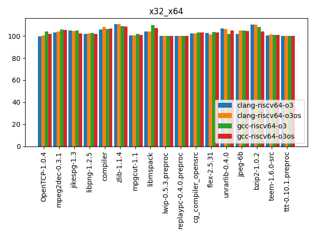
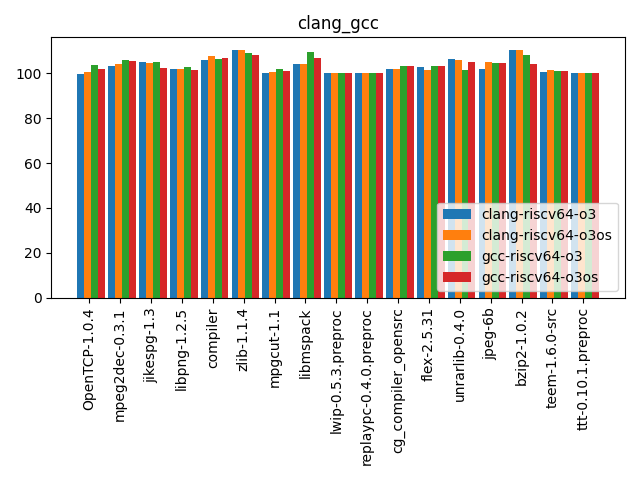
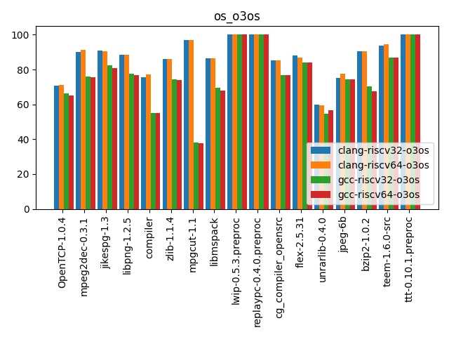

# 1 介绍

本文主要针对 “RISCV 工具链数据报第一期：CodeSize面面观” 复现实验过程，即对 GNU 和 LLVM-Clang toolchain ，利用 CSiBE benchmark 进行 codesize 方面的对比。

# 2 Toolchain 的源码及构建

## 2.1 编译构建 riscv-gnu-toolchain

### 下载源码

```shell
mkdir runtimes
git clone --recursive https://github.com/riscv/riscv-gnu-toolchain
```

### 设置git代理(可选)

```shell
git config --global http.proxy http://192.168.31.246:7890
git config --global https.proxy https://192.168.31.246:7890
export http_proxy=http://192.168.31.246:7890
export https_proxy=https://192.168.31.246:7890
```

### 安装依赖

```shell
sudo apt-get install autoconf automake autotools-dev curl python3 libmpc-dev libmpfr-dev libgmp-dev gawk build-essential bison flex texinfo gperf libtool patchutils bc zlib1g-dev libexpat-dev python2 vim cmake
```

### 编译

```shell
cd riscv-gnu-toolchain
mkdir build && cd build
../configure  --prefix=/root/EternalBalance/runtimes/riscv32 --with-arch=rv32gc --with-abi=ilp32d
make

cd .. && rm -rf build && mkdir build && cd build
../configure  --prefix=/root/SAS/RISC-V/toolchain/riscv64 --with-arch=rv64gc --with-abi=lp64d
make
```

## 2.2 编译构建 LLVM-Clang

```shell
git clone https://github.com/llvm/llvm-project.git

cd llvm-project
mkdir build && cd build
cmake -DCMAKE_INSTALL_PREFIX=../../runtimes/llvm_install -DCMAKE_BUILD_TYPE="Release" -DLLVM_TARGETS_TO_BUILD="RISCV" -DLLVM_ENABLE_PROJECTS="clang;lld" -DLLVM_LINK_LLVM_DYLIB=ON -G "Unix Makefiles" ../llvm

make
make install
```

### 报错处理

#### 内存不够导致链接文件时的错误

建议减低make -jn中，n的数字，或者增大内存或Swap虚拟内存。

# 3 使用 CSiBE benchmark 得出实验结果

```shell
git clone https://github.com/szeged/csibe.git
cd csibe

./csibe.py --build-dir=./temp/ --toolchain clang-riscv32-o3 CSiBE-v2.1.1
./csibe.py --build-dir=./temp/ --toolchain clang-riscv32-o3os CSiBE-v2.1.1
./csibe.py --build-dir=./temp/ --toolchain clang-riscv64 CSiBE-v2.1.1
./csibe.py --build-dir=./temp/ --toolchain clang-riscv64-o3os CSiBE-v2.1.1

./csibe.py --build-dir=./temp/ --toolchain gcc-riscv32-o3 CSiBE-v2.1.1
./csibe.py --build-dir=./temp/ --toolchain gcc-riscv32-o3os CSiBE-v2.1.1
./csibe.py --build-dir=./temp/ --toolchain gcc-riscv64-o3 CSiBE-v2.1.1
./csibe.py --build-dir=./temp/ --toolchain gcc-riscv64-o3os CSiBE-v2.1.1
```

以上命令执行时，会在线下载 CSiBE-v2.1.1 源码压缩包，终端一直是downloading的状态，于是提前下载好这个源码包，放到，可以加快执行速度。

并且，在`/csibe/toolchain-files/`目录下新增以下8个文件指定我们的工具链和编译选项，这8个文件位于 `/20200610-RISCV-CodeSize-data/codes` 目录下。

于是，可在 `/csibe/tmp/` 文件夹下对于上述8个不同的工具链选项产生8个相应的结果文件`all-results.csv`。

以上产生的数据文件存放在 ` /20200610-RISCV-CodeSize-data/raw_all_results/` 目录下，按照 RISCV 工具链数据报第一期的处理方法，对以上数据整理可以得到类似的结果。对比图如下：

